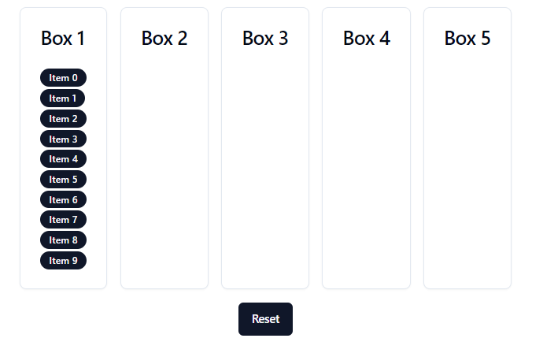

# drag-and-drop-pools
Build a web application with 5 pools that support drag &amp; drop.



## Tasks
There’re 5 pools that support drag & drop.
- 1st pool: Initially, it includes 10 items
- 2nd pool: Trash bin, items dropped on this pool should be permanently removed
- 1st, 3rd, 4th, 5th pool: Should be able to move items from one to another
- Should be able to reset the status of pools by clicking “Reset” button

## Environment
- Windows 11
- Node v20.10.0
- Npm 10.2.3

## Tech stacks
- Vite + React + Typescript
- Shadcn UI
- Tailwind CSS
- React Beautiful DnD

## Steps to run program
1. Install node modules
   ```shell
   npm install
   ```

2. Run project
   ```shell
   npm run dev
   ```
This will host the project on http://localhost:5173.